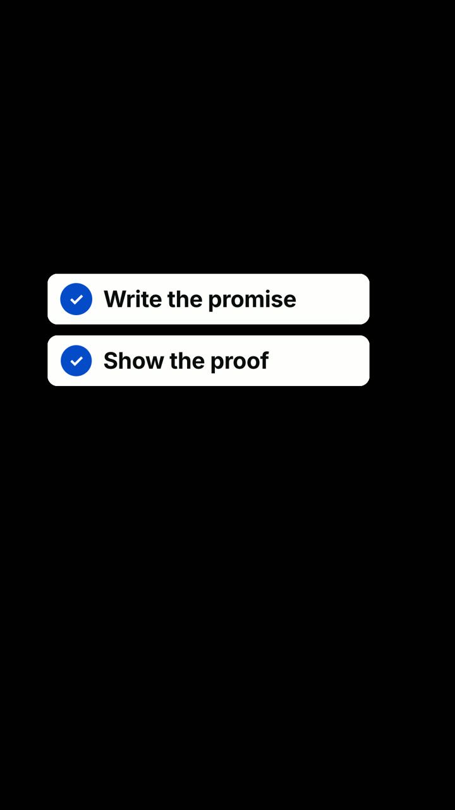
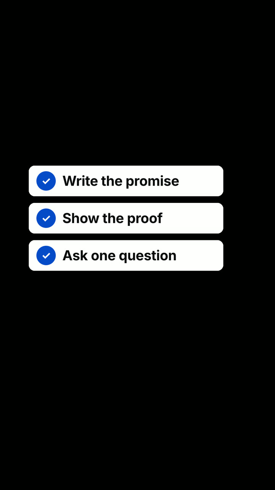

# A01 · A numbered list that builds as it is spoken

**Story job:** Let the viewer count along with the speaker.

**Use when:** The speaker names three short, parallel items.

**Do not use when:** The items are long sentences, or not parallel.

**Composition:** list-build

  
