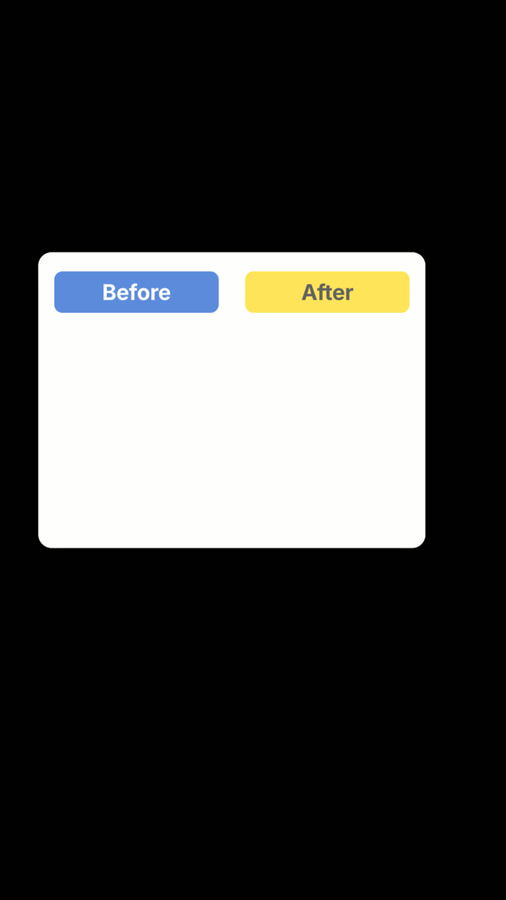
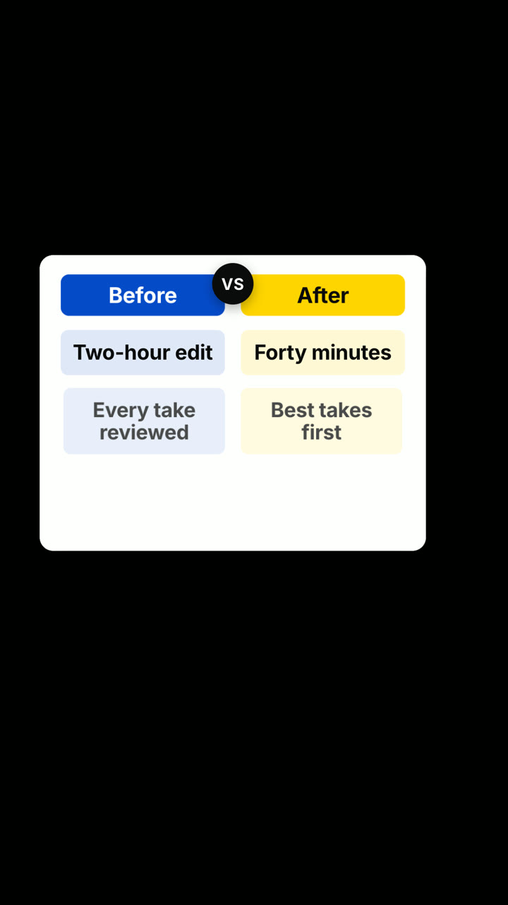
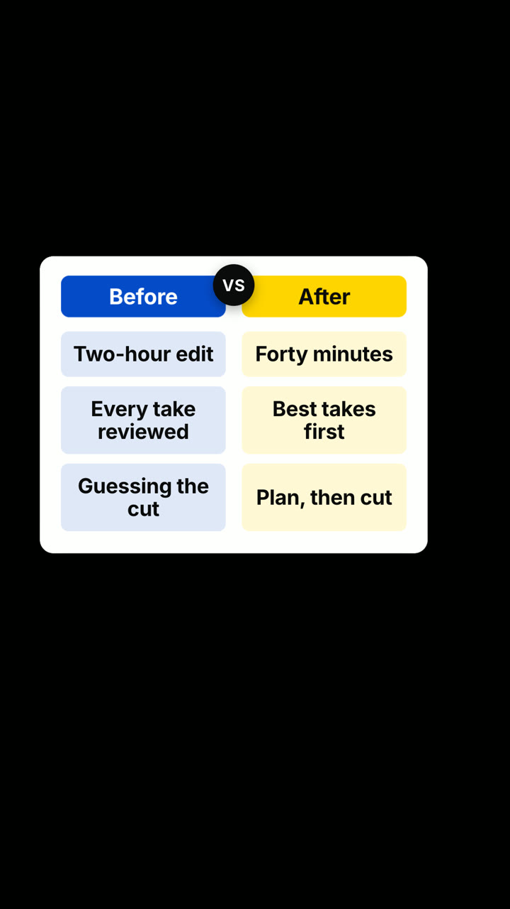

# A02 · Before and after, side by side

**Story job:** Make a change visible by putting both states in one frame.

**Use when:** The speaker contrasts a before and an after with concrete details.

**Do not use when:** The 'after' is a claim the source does not support.

**Composition:** versus-split

  
