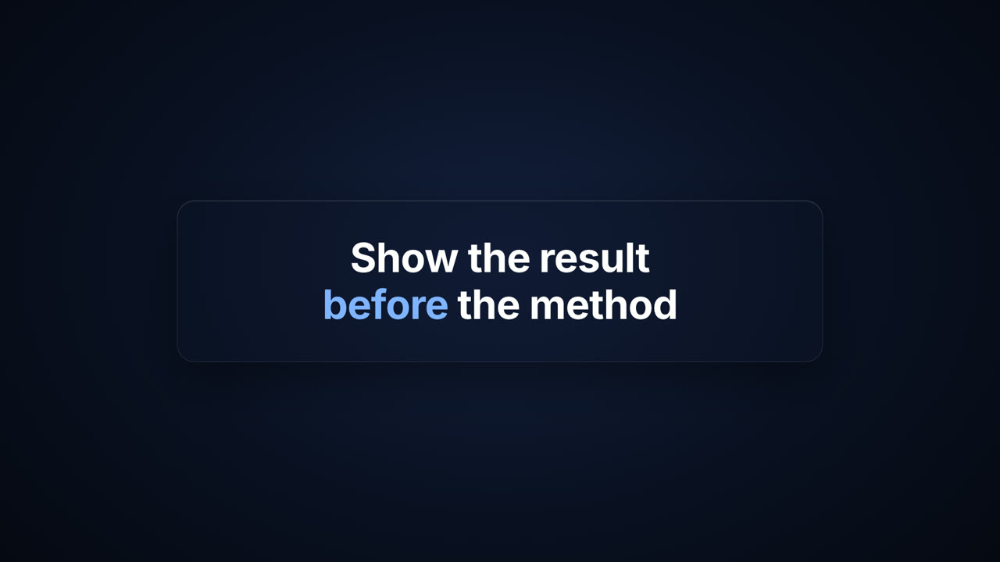

# A03 · One statement with one emphasis

**Story job:** Give a single line the whole screen when it is the thesis.

**Use when:** The line is the point the rest of the Short supports.

**Do not use when:** The line is setup rather than the thesis.

**Composition:** statement-card

  
