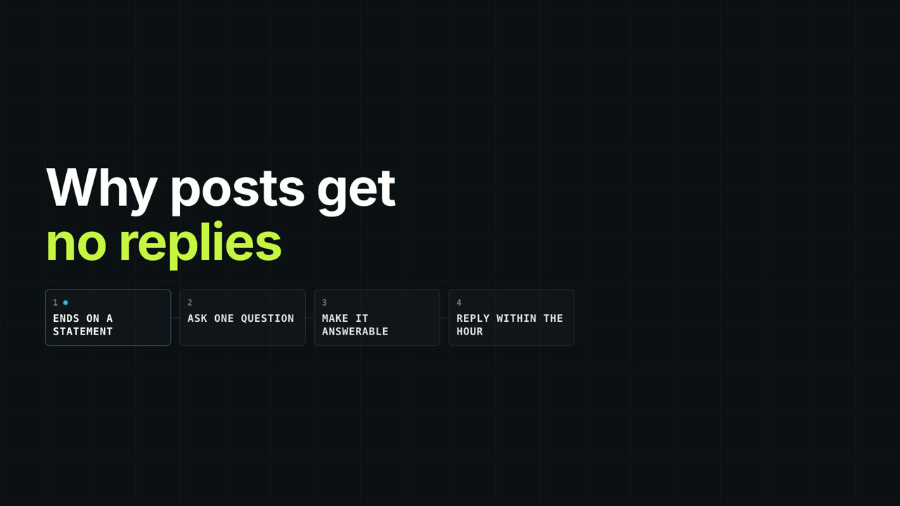
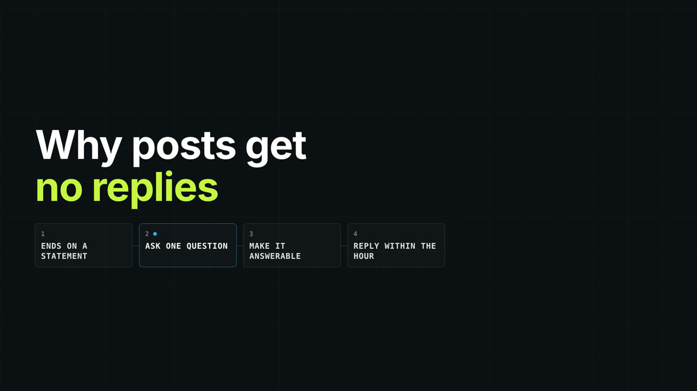
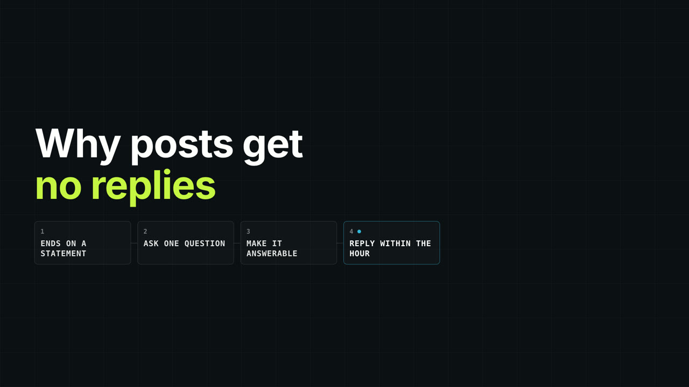

# CR07 · Problem, solution, idea, angles — then back to the speaker

Original reference rendered from Project Sniper's own templates. The copy in the pictures is illustrative; a real edit uses the speaker's words.

**Message:** A single diagram that develops from the problem to the options, so the viewer holds the whole argument in one picture.
**Arc:** problem -> solution -> the idea -> angles on it -> return to the speaker
**Execution:** Build the nodes in the order the speaker says them; light only the node being discussed; return to the presenter when the diagram is complete.
**Avoid:** Showing every node at once, or leaving the diagram up after the speaker moves on.
**Typography:** Short node labels; one headline; no paragraph text in nodes.

**Catalog:** module-pipeline, module-rail, list-build

## CR07-B01 — Name the problem

  

## CR07-B02 — Offer the solution

  

## CR07-B03 — Develop the idea

  

## CR07-B04 — Add the angles, then hand back

  
