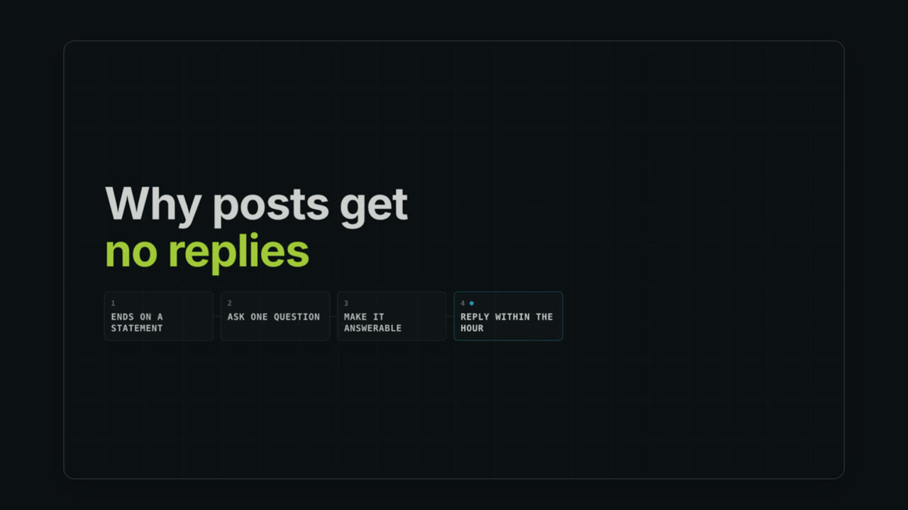
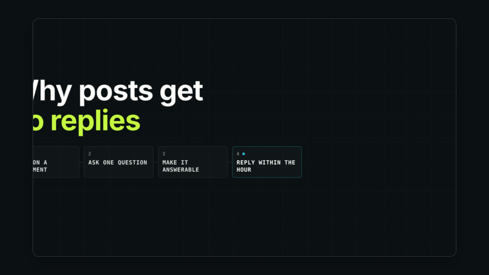
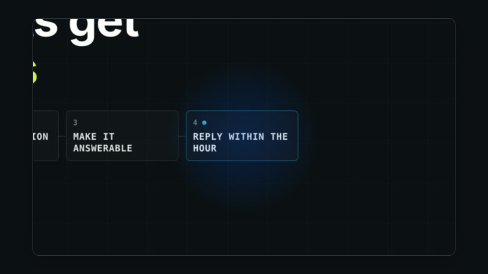

# N04 · Zoom to the control that matters

Original reference rendered from Project Sniper's own templates. The copy in the pictures is illustrative; a real edit uses the speaker's words.

**Lesson:** When the speaker refers to one part of a busy screen, move the view to that part instead of asking the viewer to find it.
**Opening:** The whole screen is shown briefly so the viewer knows where they are.
**Story arc:** whole screen -> push in on the relevant control -> hold on it
**Payoff:** The control fills the frame, with a halo marking it.

**Catalog:** ui-focus-zoom, marker-highlight

## N04-B13 — Focus a relevant control

**On screen:** The view pushes in on one region of the screen.

**Why:** Establish the whole screen, then move to the part being discussed.

  
