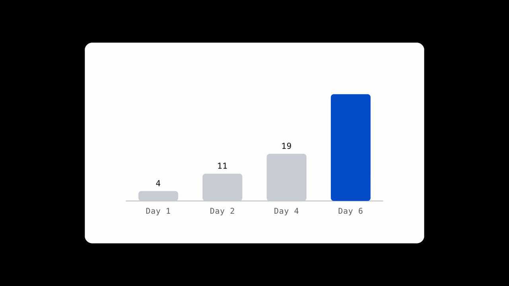
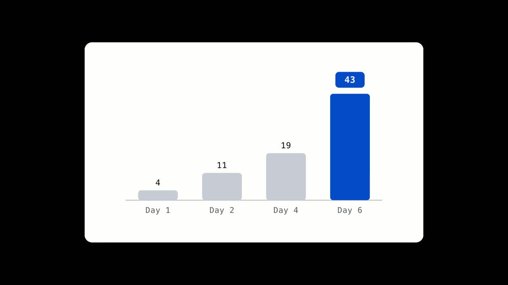

# N27 · Show value growing against time

Original reference rendered from Project Sniper's own templates. The copy in the pictures is illustrative; a real edit uses the speaker's words.

**Lesson:** When the claim is about how much something gains over time, show the amount and the time together so the viewer sees the rate, not just the total.
**Opening:** The starting value appears before any growth.
**Story arc:** starting value -> the number climbs -> the time bar fills -> the comparison chart settles -> hand back
**Payoff:** The final chart holds with the largest bar emphasised.

**Catalog:** count-up, widget-gauge, chart-story, stat-card

## N27-B01 — The number climbs

**On screen:** A counter rises to the stated figure.

**Why:** Let the number arrive; do not start on the total.

  

## N27-B02 — Time passes on the same screen

**On screen:** A marker advances along a labelled bar.

**Why:** Pair the gain with the time it took.

  

## N27-B03 — Compare periods

**On screen:** Bars grow period by period and the last is emphasised.

**Why:** A comparison makes the rate readable at a glance.

  
