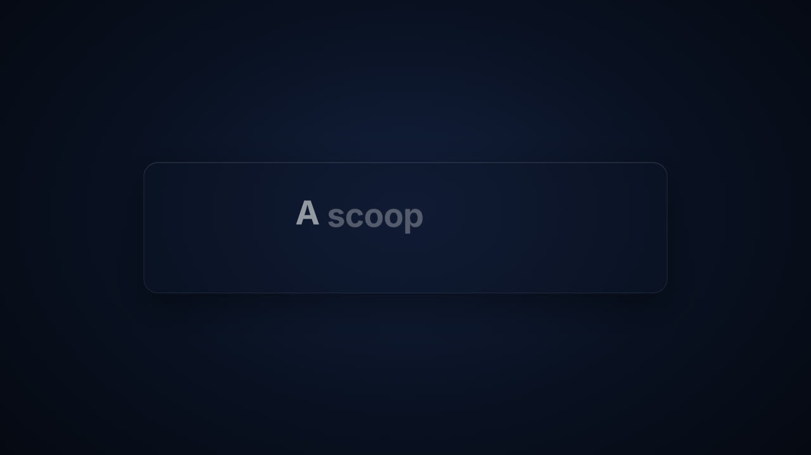
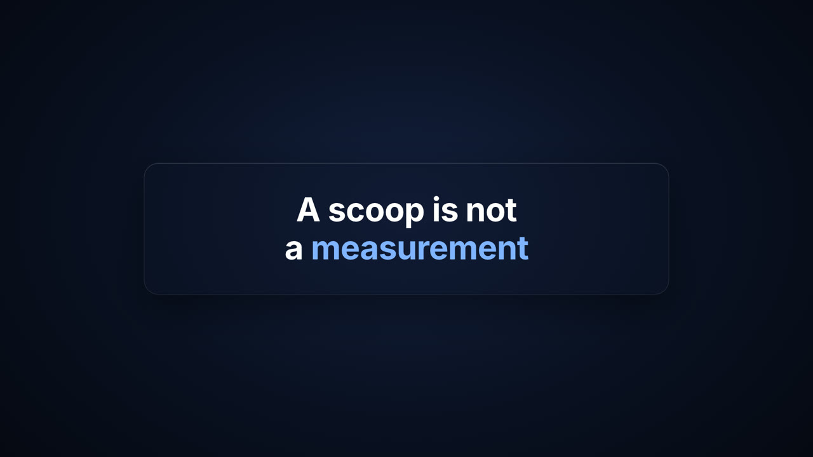
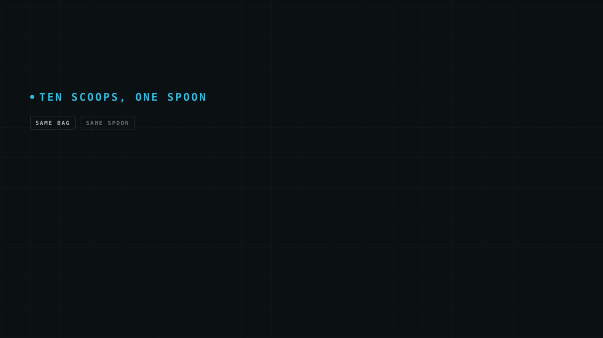
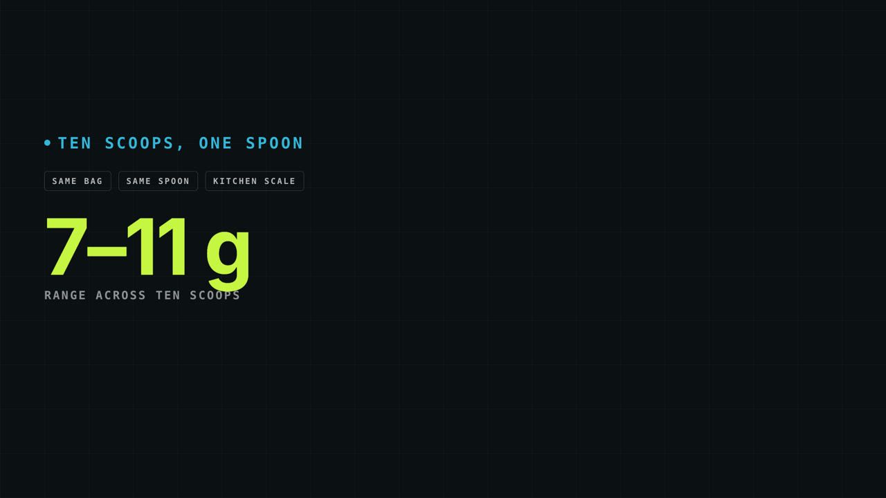
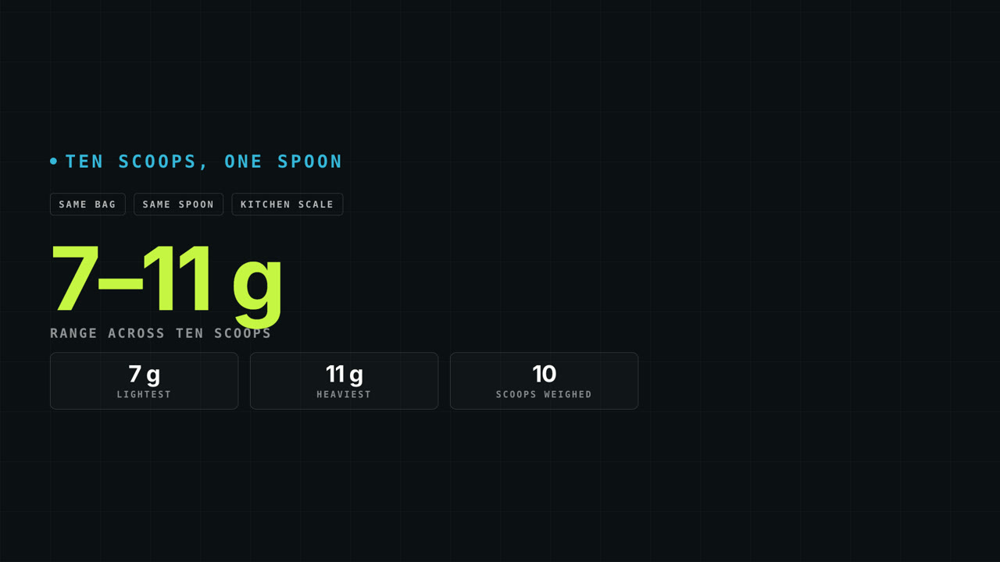
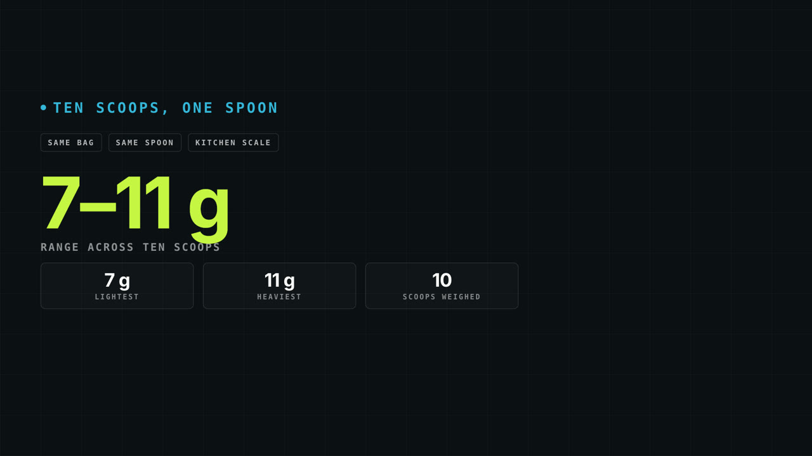
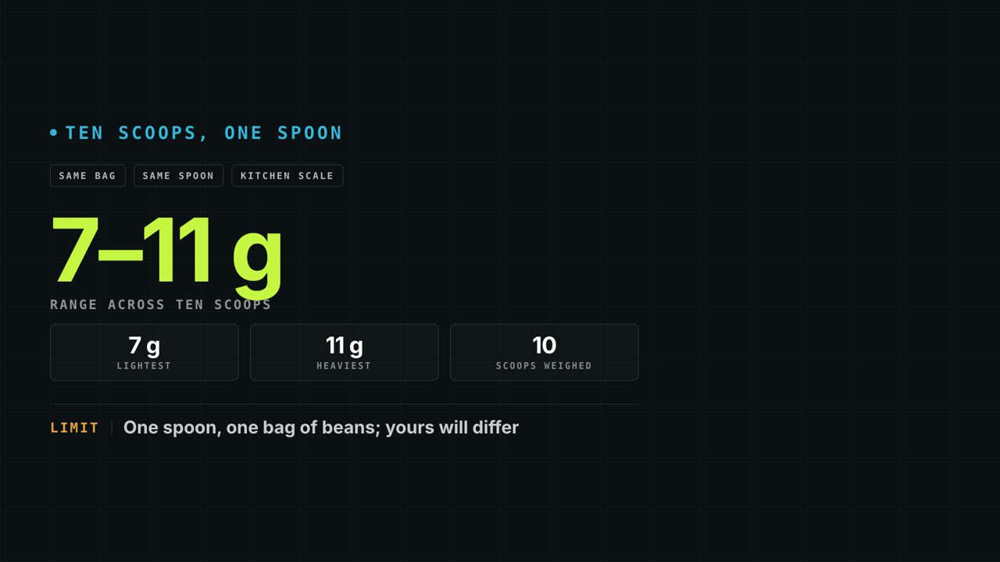

# SQ01 — State the claim, then show the measured spread and its limit

Original reference written for Project Sniper and rendered from its own motion templates. Adapt the mechanism with the speaker's own words and footage; never reuse this copy or its numbers.

**Lesson:** A claim earns belief when the measurement behind it follows at once, with what was and was not measured visible on the same screen.
**Opening:** The claim alone, as one short statement with one accented word.
**Story arc:** Claim → the measured range and what was counted → the limit of the measurement.
**Payoff:** The viewer sees the spread that supports the claim and the conditions it was measured under.

Compositions: statement-card, module-scoreboard, stat-card

## SQ01-B01 — A scoop is not a measurement.

Visible: One statement on its own, the key word accented.

Why this picture: The claim is short enough to read in one glance before any evidence arrives.

  

## SQ01-B02 — I weighed ten scoops from the same bag. They ranged from seven to eleven grams.

Visible: The range lands as the hero figure; the lightest, the heaviest and the count arrive as tiles.

Why this picture: The spread is the evidence, and the tiles say exactly what was counted.

  

## SQ01-B03 — That is one spoon and one bag, so yours will differ. It will not be zero.

Visible: The same board gains a limit footer naming the spoon and the bag.

Why this picture: Putting the limit on screen stops one kitchen's numbers from reading as a universal result.

  
