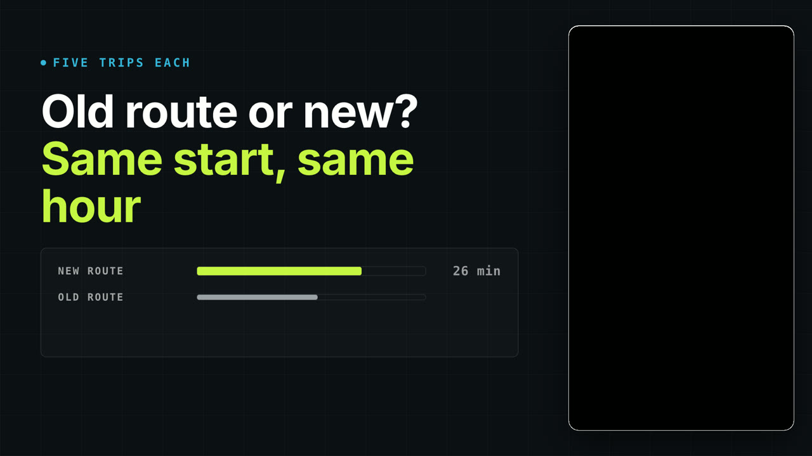
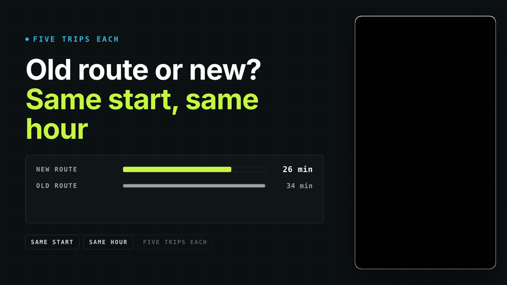
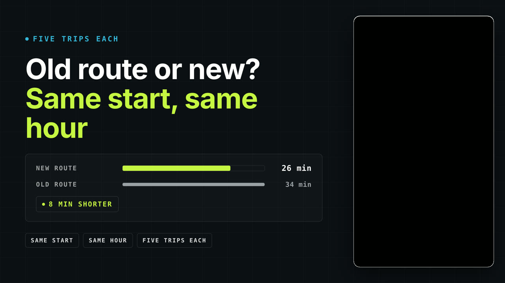

# SQ02 — Let both bars land before naming the difference

Original reference written for Project Sniper and rendered from its own motion templates. Adapt the mechanism with the speaker's own words and footage; never reuse this copy or its numbers.

**Lesson:** When two measured values are compared, show both before stating the difference, then show the conditions that make the comparison fair.
**Opening:** A two-line headline asks which option is faster; no bars yet.
**Story arc:** Question → both measured bars → the difference → the conditions both options shared.
**Payoff:** The viewer reads the difference and knows the comparison was like for like.

Compositions: module-takeover, module-bullet-bars, stat-card

## SQ02-B01 — Is the new route actually faster?

Visible: The headline and its eyebrow, with the bar area still empty.

Why this picture: Asking before answering gives the bars a question to settle.

  

## SQ02-B02 — Five trips each: thirty-four minutes the old way, twenty-six the new way.

Visible: Both bars grow to their measured values; the difference is not shown yet.

Why this picture: Seeing both values first lets the viewer judge the gap before hearing it.

  

## SQ02-B03 — Eight minutes shorter, from the same start at the same hour.

Visible: The difference chip and the three shared conditions land last.

Why this picture: The conditions come last because they are what makes the difference trustworthy.

  
