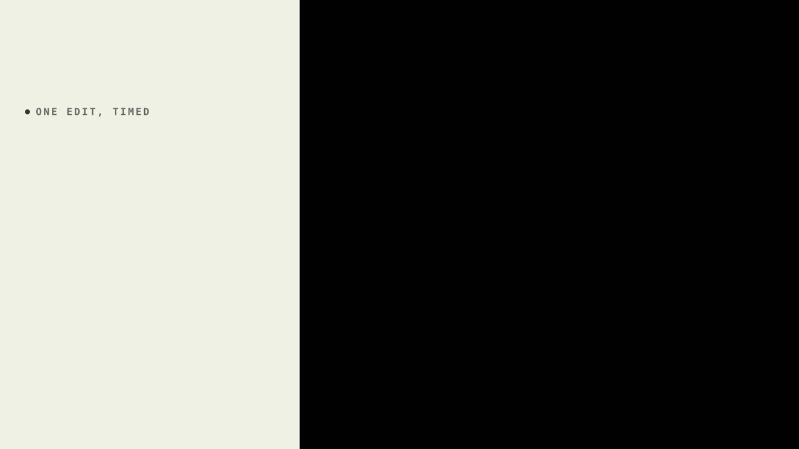
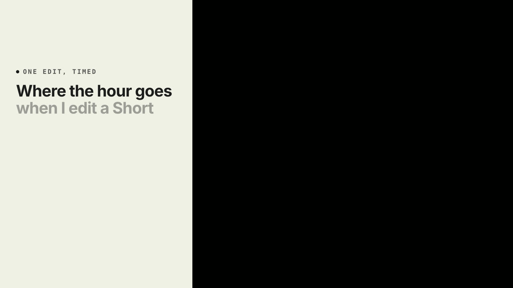
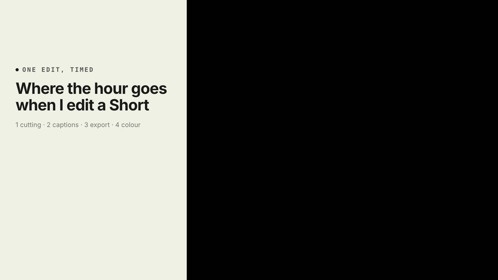
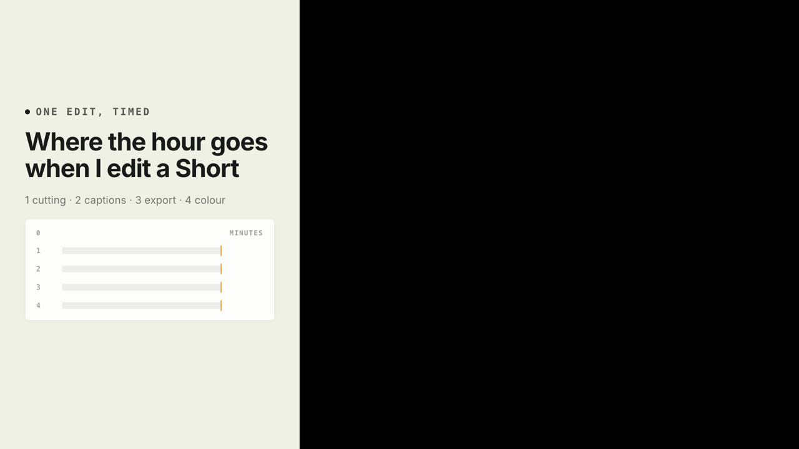
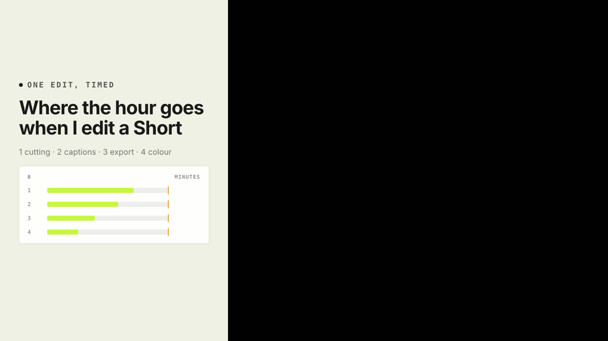
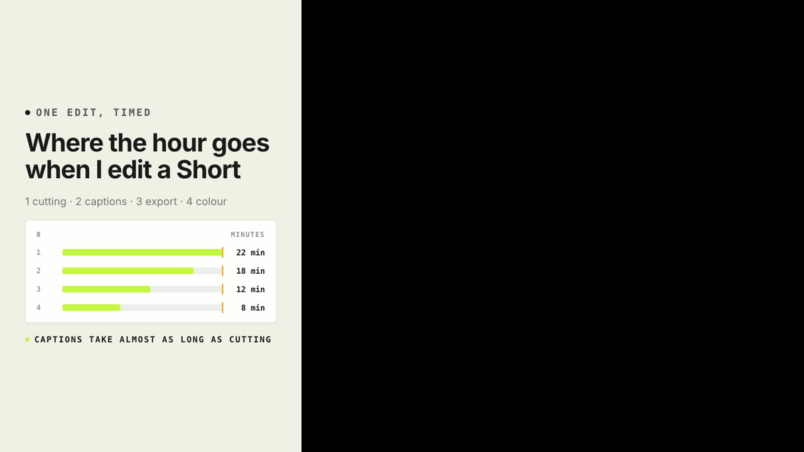

# SQ03 — Rank every part on one axis before naming the largest

Original reference written for Project Sniper and rendered from its own motion templates. Adapt the mechanism with the speaker's own words and footage; never reuse this copy or its numbers.

**Lesson:** When a total is broken into parts, put every part on one axis first and name the largest only after the viewer can see that it is the largest.
**Opening:** The headline names the total being broken down, with a one-line key to the parts.
**Story arc:** The hour → four parts on one axis → the verdict on the part worth fixing.
**Payoff:** The viewer sees which part is largest before the speaker says so.

Compositions: module-bullet-bars, module-ledger-dark, module-takeover

## SQ03-B01 — Here is where one hour of editing goes.

Visible: The headline and the key, before any bar.

Why this picture: Naming the total first tells the viewer what the bars will add up to.

  

## SQ03-B02 — Twenty-two minutes cutting, eighteen on captions, twelve exporting, eight on colour.

Visible: Four numbered bars grow on one axis, each value landing with its bar tip; a one-line key names the parts.

Why this picture: A shared axis makes the ranking visible without any extra labels.

  

## SQ03-B03 — Captions take almost as long as the cut itself.

Visible: The verdict line lands under the finished bars.

Why this picture: The verdict names what the bars already show, so it confirms rather than asserts.

  
