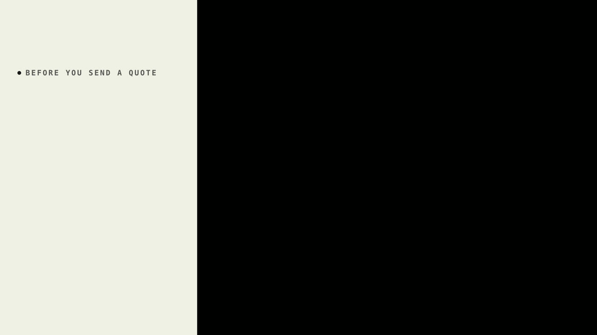
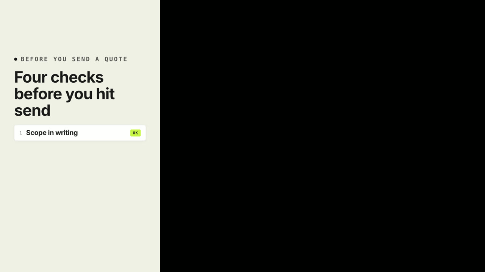
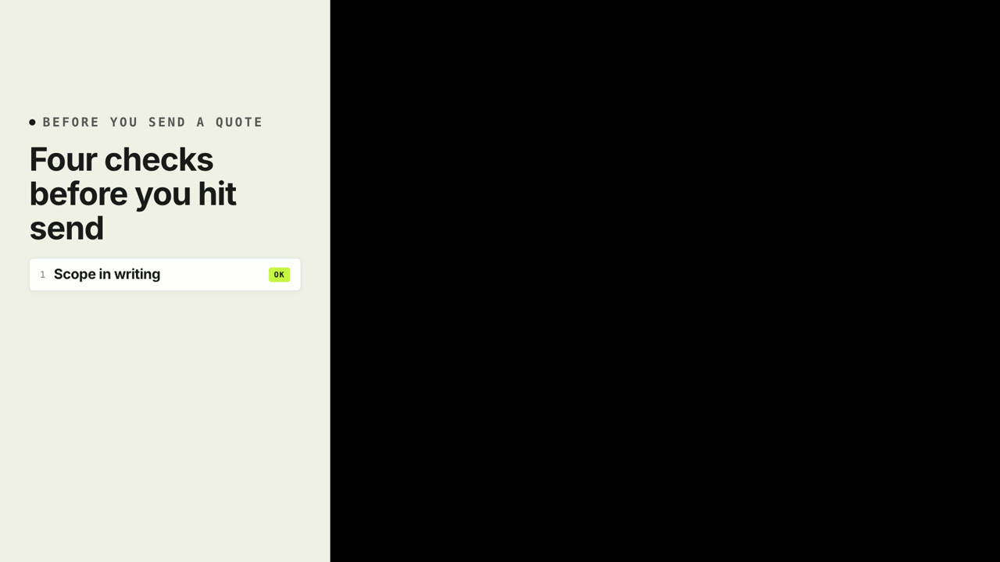
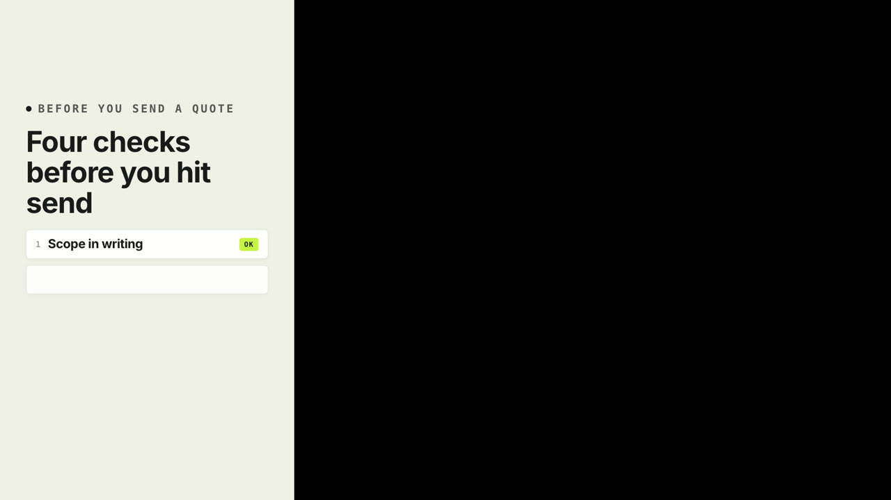
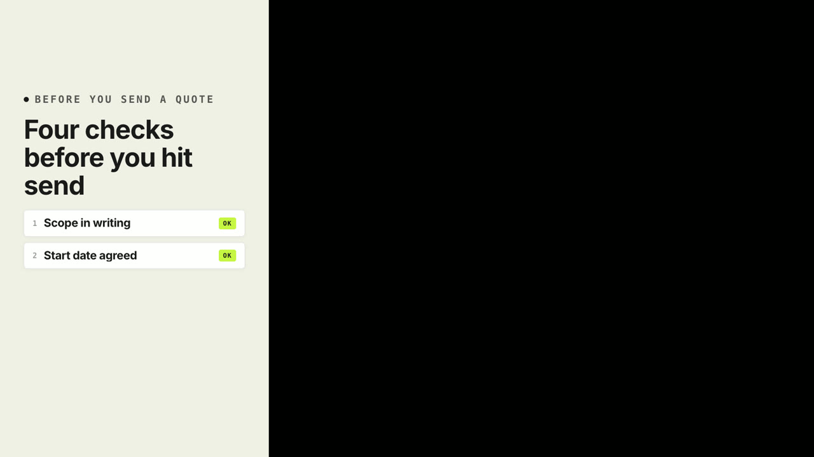
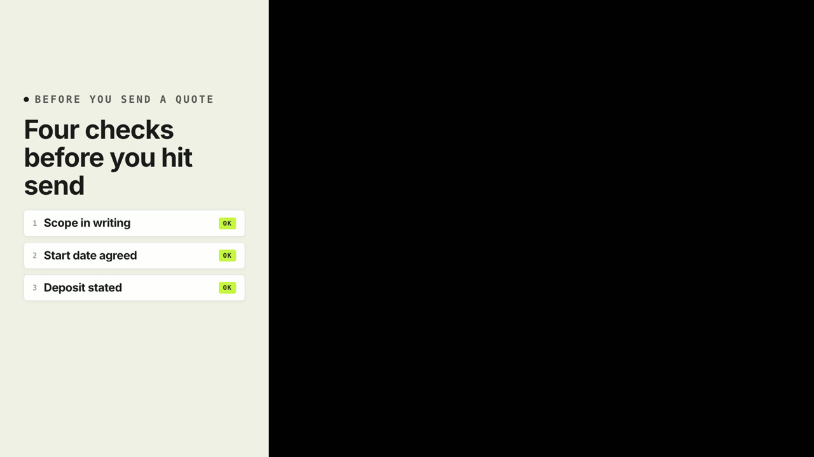
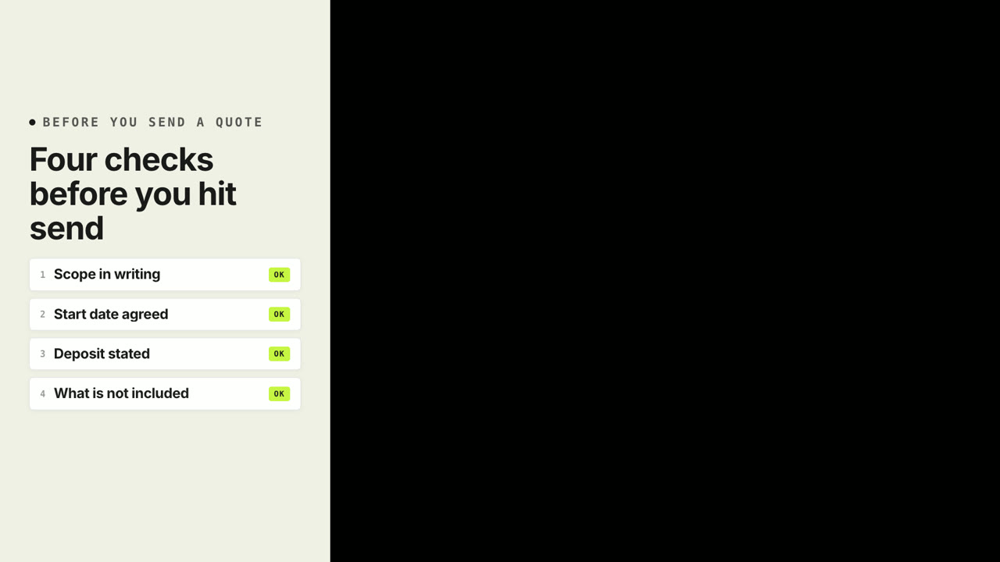
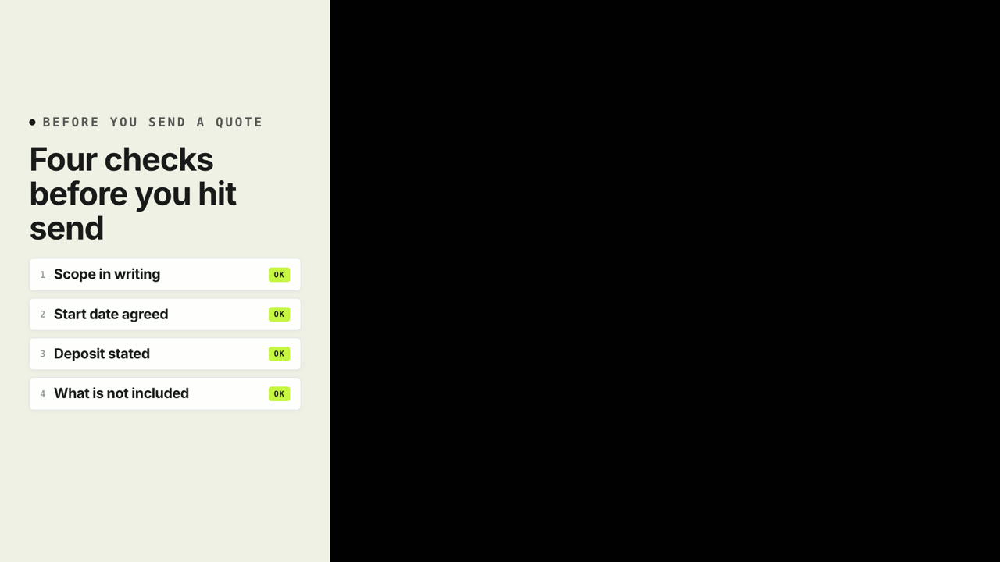

# SQ04 — Grow the checklist one row per spoken check, then mark it done

Original reference written for Project Sniper and rendered from its own motion templates. Adapt the mechanism with the speaker's own words and footage; never reuse this copy or its numbers.

**Lesson:** A checklist the speaker walks through should gain one row per spoken check, keep earlier rows in place and end on an explicit finished state.
**Opening:** The headline says what the checklist is for.
**Story arc:** Purpose → four checks, one per sentence → the finished state.
**Payoff:** The complete list stays readable and ends on a clear finished state.

Compositions: module-rail, glass-rail, list-build

## SQ04-B01 — Four checks before you send a quote. First, the scope in writing.

Visible: The headline, then the first checklist row with its badge.

Why this picture: The first row arrives with the first check, so the list and the speech stay together.

  

## SQ04-B02 — Then the start date, agreed with the client.

Visible: The second row lands under the first.

Why this picture: Earlier rows stay put, so the viewer sees the list accumulate.

  

## SQ04-B03 — The deposit, stated as an amount. And what the price does not include.

Visible: The third and fourth rows land in turn.

Why this picture: One row per spoken check, even when two checks come in one breath.

  

## SQ04-B04 — Then it is ready to send.

Visible: A footer tag marks the list finished.

Why this picture: An explicit finished state tells the viewer the list is complete, not cut off.

  
